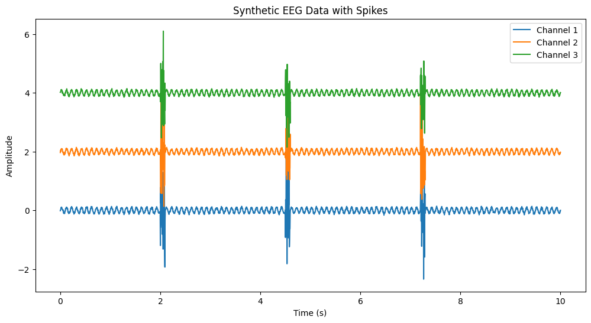
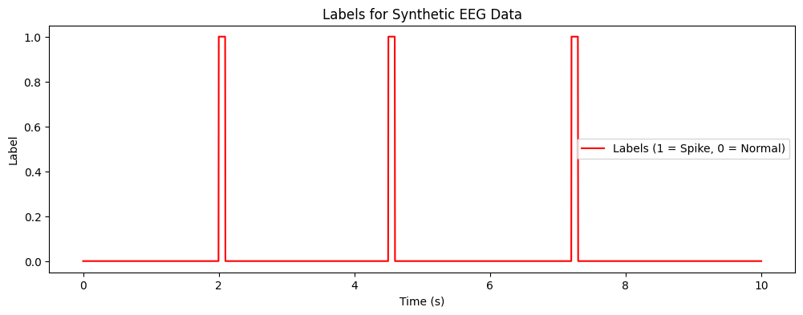
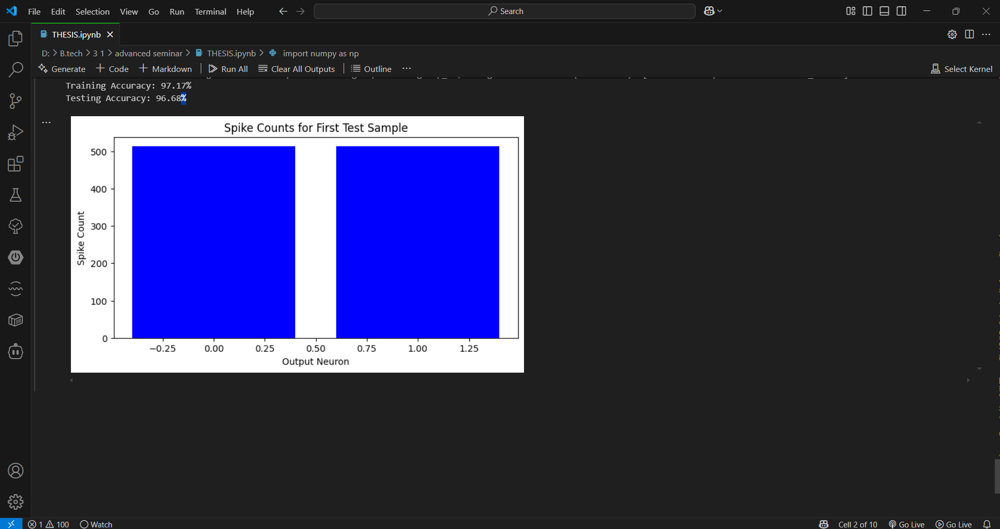

# 🧠 Real-Time Epilepsy Detection using Neuromorphic Computing

This project showcases the application of **neuromorphic computing**—specifically **Spiking Neural Networks (SNNs)**—for detecting epileptic seizures from synthetic EEG data. 
Built using the **Brian2** simulator, the model is optimized for **real-time**, **low-latency**, and **energy-efficient** classification of seizure events.

> ✅ No user interface or interactivity is provided. The system is designed purely as a trained backend model.  
> ✅ EEG data was synthetically generated to simulate realistic patterns.  
> ✅ The model performs effectively, demonstrating high accuracy with clean outputs.

## 🔍 Key Features

- EEG signals (3 channels) converted to spike trains
- Trained Spiking Neural Network (SNN)
- Accuracy:
  - 📈 **Training**: 97.17%
  - 📉 **Testing**: 96.68%
- Developed and tested in Google Colab
- No UI—focus is purely on model training & evaluation

## 🧪 Technologies Used

- Python
- Brian2
- NumPy, Pandas
- scikit-learn
- Matplotlib

## 📊 Visual Outputs

### 📌 EEG Data with Spikes

### 📌 Spike Labels

### 📌 Spike Counts - First Test Sample

## 👤 Author

**Aalokhya Karlapati**
B.Tech – Computer Science & Artificial Intelligence
Guide: Dr. Minakshmi Shaw

## 🤝 Let’s Connect

If you’re interested in neuromorphic computing, EEG-based diagnostics, or collaborative research, feel free to reach out or fork this project to extend its scope.

> Together, we can move toward smarter, more responsive, and human-centric healthcare systems.
